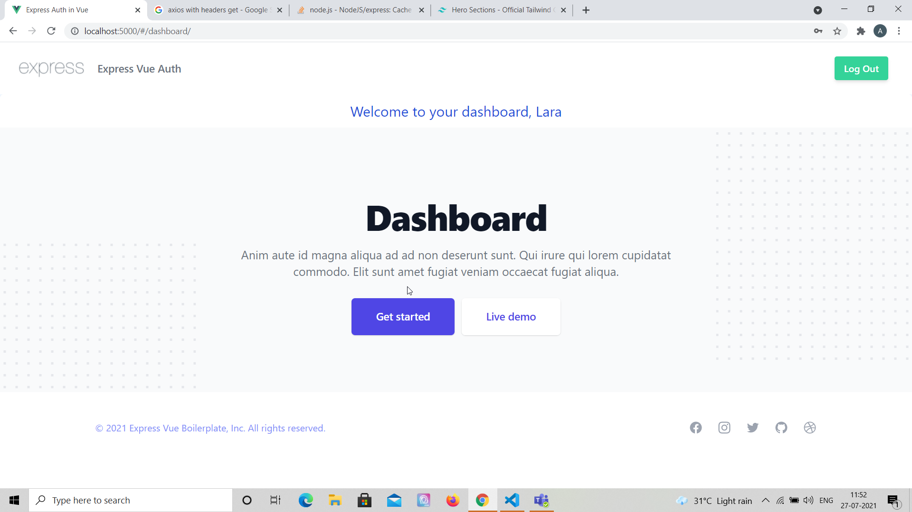

# Express Vue Auth Boilerplate using Vuex

## Project Briefing

This is a simple boilerplate to get you started with full stack applications using Express and Vue, MongoDB is used as database and tailwind css is used for UI. Yes, it's created in one of the most popular full stack technologies combination known as MEVN. 


## Built With

* [Express](https://expressjs.com/)
* [Vue](https://vuejs.org/)
* [MongoDB](https://www.mongodb.com/)
* [Vuex](https://vuex.vuejs.org/)
* [Tailwind CSS](https://tailwindcss.com/)

## Authors

* **Amit Prafulla (APFirebolt)** - (http://amitprafull.com/)

## Project setup

Simply install node modules for both frontend and backend, the project is already configured to serve build content files in production which is generated by Vue which resides inside the build folder.

Concurrently, package is used for development and allows us to launch both frontend and back-end in one go using single command. Proxy is used for API calls made to the Express server inside the Vue application using the config file.

```
npm install
npm run dev
```

For production, build the frontend of the app and then run the backend app only. 

```
npm run build
npm start
```

## Project Updates

- Minor fixes where nested routes was not working.
- Added Ejs template engine for rendering templates in Express and EJS aside from the Vue build in production.

## Project Screenshots

Please find some of the screenshots of the application. Below is the screenshot of the Home page.



Sign up page.


Login page.

